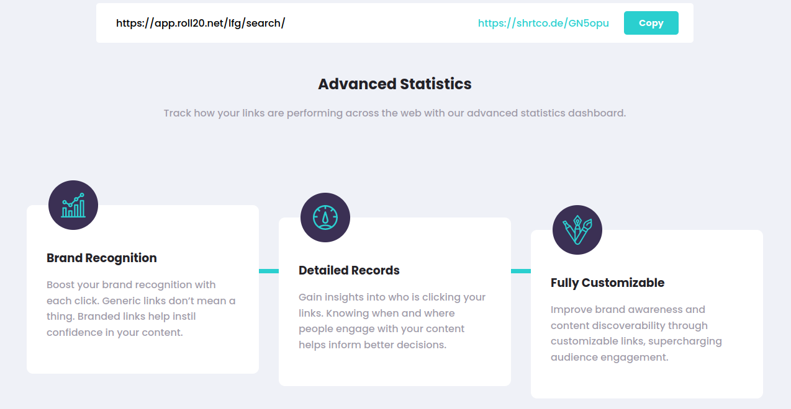

## Table of contents

- [Overview](#overview)
  - [The challenge](#the-challenge)
  - [Screenshot](#screenshot)
  - [Links](#links)
- [My process](#my-process)
  - [Built with](#built-with)
  - [What I learned](#what-i-learned)
  - [Continued development](#continued-development)
  - [Useful resources](#useful-resources)
- [Author](#author)
- [Acknowledgments](#acknowledgments)

**Note: Delete this note and update the table of contents based on what sections you keep.**

## Overview

### Screenshot

### Desafio

Os usuários devem conseguir:

- Ver o site otimizado de acordo com o tamanho da tela de seu dispositivo
- Encurtar qualquer link válido
- Ver uma lista com os links encurtados
- Copiar o link encurtado para a área de tranferência com apenas 1 clique
- Receber uma mensagem de erro ao enviar o form se:
  - O campo 'input' estiver vazio

### Links

- Solution URL: [Add solution URL here](https://your-solution-url.com)
- Live Site URL: [Add live site URL here](https://your-live-site-url.com)

## Processo

### Feito com

- HTML
- SCSS
- Flexbox
- Mobile-first workflow
- ReactJS
- Métodologia BEMCSS

